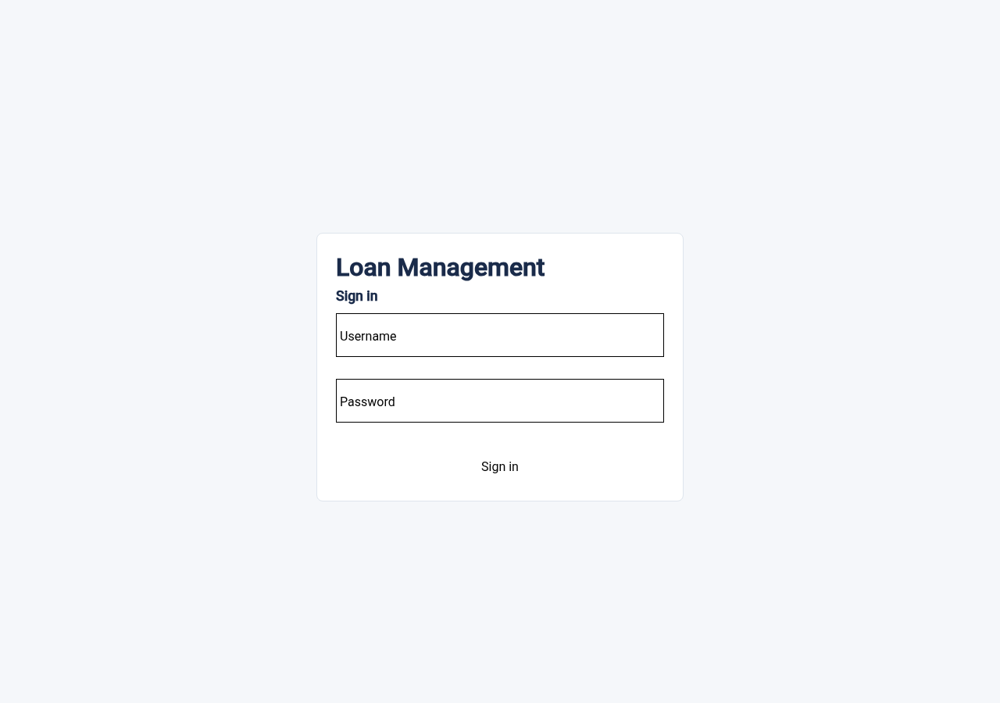
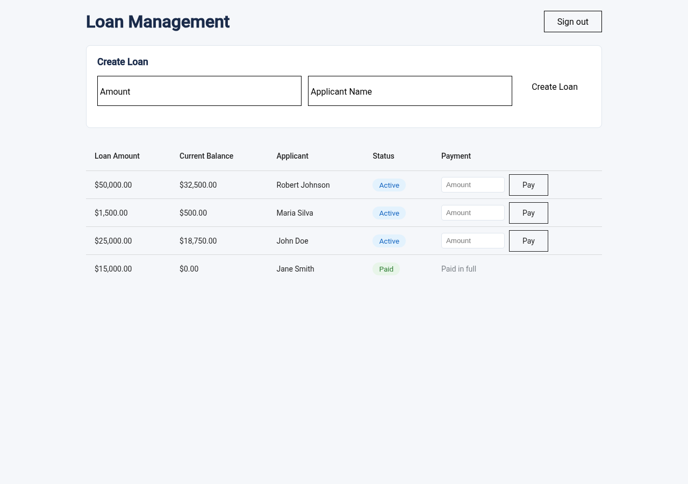
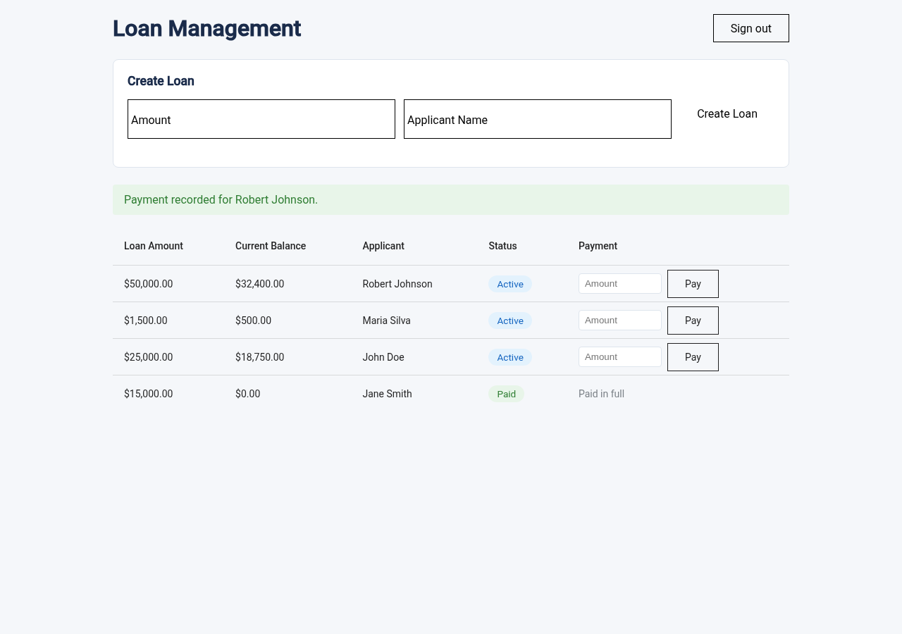
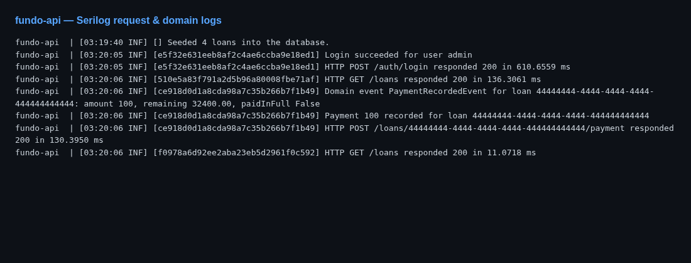

# **Take-Home Test: Backend-Focused Full-Stack Developer (.NET C# & Angular)**

## **Objective**

This take-home test evaluates your ability to develop and integrate a .NET Core (C#) backend with an Angular frontend, focusing on API design, database integration, and basic DevOps practices.

## **Instructions**

1.  **Fork the provided repository** before starting the implementation.
2.  Implement the requested features in your forked repository.
3.  Once you have completed the implementation, **send the link** to your forked repository via email for review.

## **Task**

You will build a simple **Loan Management System** with a **.NET Core backend (C#)** exposing RESTful APIs and a **basic Angular frontend** consuming these APIs.

---

## **Requirements**

### **1. Backend (API) - .NET Core**

* Create a **RESTful API** in .NET Core to handle **loan applications**.
* Implement the following endpoints:
    * `POST /loans` → Create a new loan.
    * `GET /loans/{id}` → Retrieve loan details.
    * `GET /loans` → List all loans.
    * `POST /loans/{id}/payment` → Deduct from `currentBalance`.
* Loan example (feel free to improve it):

    ```json
    {
        "amount": 1500.00, // Amount requested
        "currentBalance": 500.00, // Remaining balance
        "applicantName": "Maria Silva", // User name
        "status": "active" // Status can be active or paid
    }
    ```

* Use **Entity Framework Core** with **SQL Server**.
* Create seed data to populate the loans (the frontend will consume this).
* Write **unit/integration tests for the API** (xUnit or NUnit).
* **Dockerize** the backend and create a **Docker Compose** file.
* Create a README with setup instructions.

### **2. Frontend - Angular (Simplified UI)**

Develop a **lightweight Angular app** to interact with the backend

#### **Features:**
- A **table** to display a list of existing loans.

#### **Mockup:**
[View Mockup](https://kzmgtjqt0vx63yji8h9l.lite.vusercontent.net/)
(*The design doesn't need to be an exact replica of the mockup—it serves as a reference. Aim to keep it as close as possible.*)

---

## **Bonus (Optional, Not Required)**

* **Improve error handling and logging** with structured logs.
* Implement **authentication**.
* Create a **GitHub Actions** pipeline for building and testing the backend.

---

## **Evaluation Criteria**

✔ **Code quality** (clean architecture, modularization, best practices).

✔ **Functionality** (the API and frontend should work as expected).

✔ **Security considerations** (authentication, validation, secure API handling).

✔ **Testing coverage** (unit tests for critical backend functions).

✔ **Basic DevOps implementation** (Docker for backend).

---

## **Additional Information**

Candidates are encouraged to include a `README.md` file in their repository detailing their implementation approach, any challenges they faced, features they couldn't complete, and any improvements they would make given more time. Ideally, the implementation should be completed within **two days** of starting the test.

---

# Implementation

**.NET 8** REST API · **Angular 19** · **SQL Server** · **Docker Compose**

See also: [backend/src/README.md](backend/src/README.md) · [frontend/README.md](frontend/README.md) · [docs/architecture.md](docs/architecture.md)

## Quick start (Docker)

```bash
docker compose up --build
```

One command starts SQL Server, API, and frontend. The API runs migrations and seeds sample loans on startup.

| # | Service    | Container         | Port | Waits for          |
|---|------------|-------------------|------|--------------------|
| 1 | SQL Server | `fundo-sqlserver` | 1433 | —                  |
| 2 | API        | `fundo-api`       | 5000 | SQL Server healthy |
| 3 | Frontend   | `fundo-frontend`  | 4200 | API healthy        |

**Open** http://localhost:4200/login — credentials: **admin / admin123**

| Access | URL |
|--------|-----|
| App (browser) | http://localhost:4200 |
| API via proxy | http://localhost:4200/api/ |
| API direct (optional) | http://localhost:5000 |
| SQL Server | localhost:1433 |

The browser only needs port **4200** — `/api` is proxied by nginx (Docker) or `proxy.conf.json` (local dev).

```bash
docker compose ps          # check status (running / healthy)
docker compose down        # stop
docker compose down -v     # stop and remove DB volume
```

**Prerequisites:** Docker + Compose; ports 4200, 5000, 1433 free. First `--build` is slow; later starts are faster.

**Config (optional):** `cp .env.example .env` — defaults in `docker-compose.yml` work without it.

## Screenshots

Captured with `docker compose up --build` running locally.

| Login | Loans table | Payment recorded |
|-------|-------------|------------------|
|  |  |  |

**Structured API logs** (Serilog — `/health` omitted):



## Local development (no Docker)

Two terminals. Backend uses an **InMemory** DB (`appsettings.Development.json`).

```bash
# Terminal 1 — API at http://localhost:5000
cd backend/src && dotnet run --project Fundo.Applications.WebApi

# Terminal 2 — UI at http://localhost:4200 (proxies /api → :5000)
cd frontend && npm install && npm start
```

Same login URL and credentials as Docker.

## API

| Method | Path | Auth | Description |
|--------|------|------|-------------|
| `POST` | `/auth/login` | — | Login (httpOnly cookie) |
| `POST` | `/auth/logout` | JWT | Clear session |
| `GET` | `/auth/me` | JWT | Session status |
| `GET` | `/health` | — | Health check |
| `GET` | `/loans` | JWT | List loans |
| `GET` | `/loans/{id}` | JWT | Loan details |
| `POST` | `/loans` | JWT | Create loan |
| `POST` | `/loans/{id}/payment` | JWT | Record payment |

## Project structure

```
backend/
  Dockerfile              # build context: repo root
  src/
    Fundo.Domain/         # Entities, business rules
    Fundo.Application/    # Use cases, DTOs
    Fundo.Infrastructure/ # EF Core, JWT, repositories
    Fundo.Applications.WebApi/
    Fundo.Services.Tests/

frontend/
  Dockerfile              # build context: repo root
  src/app/
    features/login/
    features/loans/
    services/
    guards/

nginx/nginx.conf          # /api proxy (Docker)
docker-compose.yml
.github/workflows/ci.yml
```

## Tests & CI

```bash
# Backend — 38 tests
cd backend/src && dotnet test

# Frontend — 7 tests
cd frontend && npm install
npm test -- --no-watch --browsers=ChromeHeadlessNoSandbox
```

CI on push/PR to `main`: backend build + test (coverage), frontend build + test, `docker compose build`.

## Take-home checklist

| Area | Status |
|------|--------|
| `POST/GET /loans`, `GET /loans/{id}`, `POST /loans/{id}/payment` | ✅ |
| EF Core + SQL Server + seed data | ✅ |
| Angular table (list, create, pay) | ✅ |
| Backend tests (xUnit) | ✅ 38/38 |
| Frontend tests (Jasmine/Karma) | ✅ 7/7 |
| Docker Compose | ✅ |
| **Bonus:** JWT httpOnly cookie auth | ✅ |
| **Bonus:** Serilog structured logging | ✅ |
| **Bonus:** GitHub Actions CI | ✅ |

## Architecture

→ [docs/architecture.md](docs/architecture.md) — system diagram, backend layers, payment flow, security, and design decisions

## Implementation notes

### Approach

Clean Architecture with four layers (Domain → Application → Infrastructure → WebApi), repository pattern, and a rich domain model (`Loan.Create`, `Loan.RecordPayment`). The API is stateless; JWT lives in an httpOnly cookie. Docker Compose runs the full stack (SQL Server + API + nginx + Angular) from a single `docker compose up --build`. Details: [docs/architecture.md](docs/architecture.md).

### Challenges faced

- **API behind nginx in Docker** — Browser calls `localhost:4200/api`, not the API container directly. Needed `nginx.conf`, CORS with credentials, and `withCredentials: true` in Angular so the JWT cookie works.
- **JWT in httpOnly cookie** — `JwtBearer` reads the token from the `fundo_auth` cookie (`OnMessageReceived`), not only from the `Authorization` header.
- **SQL Server boot order** — API crashed if it started before SQL was ready. Fixed with health checks and `depends_on: condition: service_healthy` in Compose.
- **Local dev vs Docker** — `dotnet run` uses InMemory; Docker uses SQL Server. Kept explicit via `Database__Provider` in Compose and `appsettings.Development.json`.

### Features not completed

Everything **required** by the brief (4 loan endpoints, EF Core + SQL Server + seed, loan table, tests, Docker, README) is done. Bonus items (auth, logging, CI) are also done.

What is **not** in the project:

- **Loan detail page** in Angular — `GET /loans/{id}` exists in the API, but the UI is a single table screen (the brief only required a table).
- **Payment history** in the UI — payments are saved in the database; only the updated balance is shown.
- **E2E tests** — backend has unit/integration tests; frontend has service/component tests.
- **Pixel-perfect mockup** — layout follows the [reference](https://kzmgtjqt0vx63yji8h9l.lite.vusercontent.net/), but styling is simplified.

### Public internet deployment

**This project is for local evaluation only.** Do not expose it to the public internet as-is.

If the question is “can I put this on the internet?”, the answer is **no** — not without at least:

- **Strong secrets** via env / secrets manager (JWT signing key, SQL `sa` password, auth credentials) — never the demo defaults in `docker-compose.yml`
- **`ASPNETCORE_ENVIRONMENT=Production`** — today Docker runs `Development` (Swagger on, verbose logging)
- **HTTPS** — TLS termination at nginx or a reverse proxy; JWT cookie should use `Secure` over TLS
- **Do not expose port `1433`** — SQL Server should stay on the internal Docker network only
- **Disable Swagger** in production (`EnableSwagger: false`)
- **Generic 500 responses** — do not return internal `exception.Message` to clients

These hardening steps are **out of scope** for this take-home (localhost + `docker compose up`). The demo credentials (`admin` / `admin123`) and default JWT key are documented intentionally for reviewers.

### Future improvements

With more time on **this same scope**, I would:

- Show **payment history** in the UI (payments are already persisted in SQL Server).
- Expose **Swagger** through nginx at `/api/swagger` in Docker (today it only works on http://localhost:5000).
- Add one **E2E test** (login → list loans → record payment) to complement the existing unit/integration tests.
