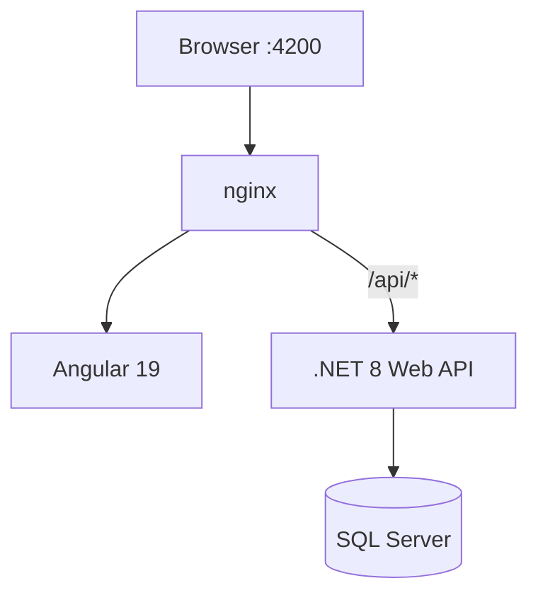
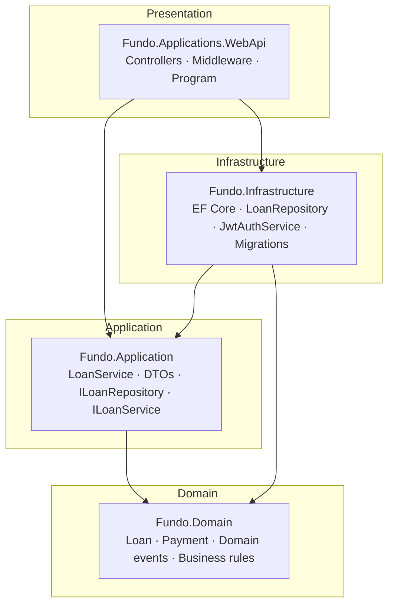
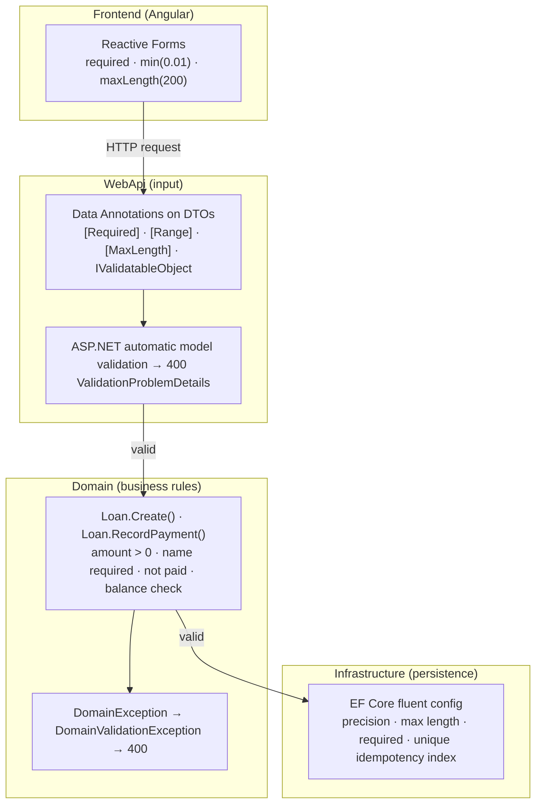
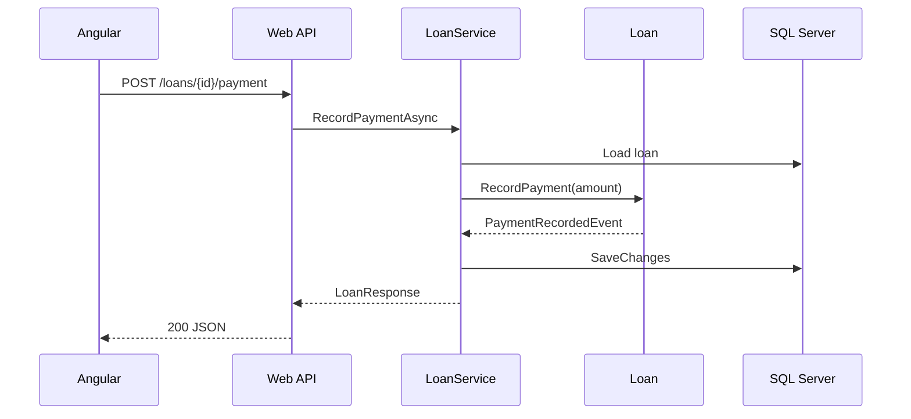

# Architecture

## System overview

The browser talks only to **port 4200**. nginx serves the SPA and proxies `/api` to the API container (internally on `:8080`, exposed as `:5000` for direct access).

| Component | Role |
|-----------|------|
| **Angular** | Login, loan table, create loan, record payment |
| **nginx** | Static files + reverse proxy `/api` → API |
| **Web API** | REST endpoints, JWT, use-case orchestration |
| **SQL Server** | Persistence, migrations, seed data |

### Docker layout

Both images are built from the **repo root** (`context: .` in `docker-compose.yml`):

| Image | Dockerfile | Why root context |
|-------|------------|------------------|
| API | `backend/Dockerfile` | Copies `backend/src/...` |
| Frontend | `frontend/Dockerfile` | Copies `frontend/...` + `nginx/nginx.conf` |

## Backend layers (Clean Architecture)

Dependencies point **inward** — Domain has no external references; infrastructure details (SQL Server, JWT, EF) stay at the edge.

| Layer | Project | Contents |
|-------|---------|----------|
| **Domain** | `Fundo.Domain` | `Loan`, `Payment`, exceptions, domain events |
| **Application** | `Fundo.Application` | `LoanService`, DTOs, `ILoanRepository`, mapping |
| **Infrastructure** | `Fundo.Infrastructure` | EF Core, `JwtAuthService`, migrations, seed |
| **WebApi** | `Fundo.Applications.WebApi` | Controllers, error and trace middleware |

## Validation

Validations are applied at **every layer** — client, API input, domain rules, and database constraints.

| Layer | Where | Examples |
|-------|-------|----------|
| **Frontend** | `login.component`, `loans.component` | Username/password required; loan amount ≥ 0.01; applicant name max 200 chars |
| **Application (DTOs)** | `CreateLoanRequest`, `PaymentRequest`, `LoginRequest` | `[Required]`, `[Range(0.01, …)]`, `[MaxLength(200)]`, `IValidatableObject` for whitespace |
| **Domain** | `Loan.Create`, `Loan.RecordPayment` | Invalid amount, empty name, loan already paid, payment exceeds balance |
| **Infrastructure** | `LoanDbContext` | `HasPrecision(18,2)`, `HasMaxLength`, unique index on `(LoanId, IdempotencyKey)` |

Invalid API input returns **400** with `ValidationProblemDetails`. Domain rule violations return **400** via `GlobalExceptionHandler` (`DomainValidationException`). Concurrency and idempotency conflicts return **409**.

## Payment flow

## Design decisions

| Decision | Why |
|----------|-----|
| Clean Architecture + repository | Business rules testable without HTTP/EF |
| JWT in httpOnly cookie (`fundo_auth`) | Stateless auth; mitigates XSS token theft |
| `Authorization: Bearer` fallback | API clients and integration tests |
| SQL Server + EF migrations (Docker) | Requirement; auto seed on startup |
| InMemory DB (local dev) | Fast iteration without Docker |
| `Idempotency-Key` on payments | Safe retries |
| `RowVersion` | Optimistic concurrency → 409 Conflict |
| Serilog | Structured logs with `TraceId`; `/health` requests omitted from request log |
| OpenTelemetry | Tracing enabled; console exporter off in Docker, on for local `dotnet run` |
| Frontend `LoggerService` | Level-based console logging; HTTP interceptor in dev only |
| RFC 7807 ProblemDetails | Consistent API errors with `traceId` |
| nginx same-origin `/api` | No CORS issues for the SPA |
| GitHub Actions CI | Build, test, Docker validation on every PR |

## Security

| Control | Detail |
|---------|--------|
| Authentication | JWT in httpOnly cookie; Bearer header for API clients |
| Password storage | BCrypt; credentials from config/env |
| Authorization | `[Authorize]` on all `/loans` endpoints |
| Rate limiting | Login: 10 req/min per IP |
| Input validation | Data Annotations on DTOs + domain rules |
| CORS | Explicit origin allowlist with credentials |
| Headers | `X-Content-Type-Options`, `X-Frame-Options` via nginx |

**Scope:** single demo user (`admin` / `admin123`) configured via env.

## Frontend logging

| Environment | Level | HTTP request logs |
|-------------|-------|-------------------|
| `ng serve` (dev) | Debug | Yes — `[INF] HTTP GET /loans responded 200 in 4.0 ms` |
| Docker / prod build | Warn | No — only warnings and errors |

- **`LoggerService`** — central logger with `[HH:mm:ss.SSS LEVEL] [Context] message` format (aligned with backend Serilog)
- **`httpLoggingInterceptor`** — logs API calls in dev; skips `/health`
- **`errorInterceptor`** — logs API failures; silences expected 401 on `/auth/login` and `/auth/me`
